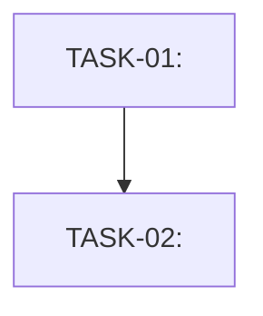

# Plan: <Title>

## Dependency Diagram

## Implementation Tasks
### TASK-01 [medium] — <Title>
**DoD:** <Deliverable. Traces: FR-001, SC-001.>

**File Changes:**
- `path/to/file.py`: <Rationale for change/creation>

**Step-by-Step:**
1.  <Detail instruction>
2.  <Detail instruction>

## Verification (SC Coverage)
| SC | How Verified |
|----|-------------|
| SC-001 | <Test / manual check / linter output> |
