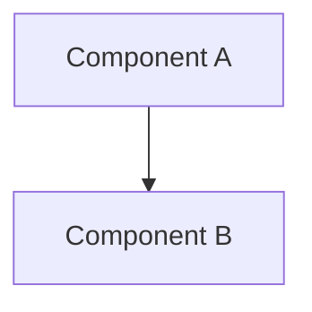

# 1. Background & Intent
### Business Problem
<3–5 sentences in plain English describing the problem. Casual reader friendly.>

### Technical Plan
<Jargon-light description of big components and how they fit together. Explanatory prose.>

# 2. Context & Scenarios
*Feature:* <User Stories (As a... I want...) and Acceptance Scenarios>
*Bugfix:* <Hypothesis and Investigation Notes>

# 3. Functional Requirements
### FR-001 — <Title>
<1–3 sentences. Implementation-agnostic. No technology names.>

# 4. Edge Cases & Error Scenarios
- <Boundary condition>: expected behaviour.

# 5. Success Criteria
### SC-001: <Measurable criterion>
<1–2 sentences, pass/fail verifiable. Quantitative where possible.>

# 6. Interfaces & Constraints (HALT ZONE)
> [!WARNING]
> **AGENT DIRECTIVE:** If implementing this feature requires modifying any of the interfaces or violating any constraints listed below, YOU MUST HALT AND REQUEST HUMAN APPROVAL.

### 6.1 Per-Component Interface Changes
*   **<Component 1>**: <Interface contract, function signatures, or column changes>

### 6.2 Constraints Applied
*   <System, performance, or dependency constraints>

# 7. Architecture & Decisions (ADR)
*Research gate: skipped — Bolt extends existing <pattern>. / Invoked — see `[[docs/research/topic.md]]`.*

### 7.1 <Primary Design Decision Title>
<HOW. Every choice justified. Reference RD-NNN from research.md if research ran.>

### 7.2 Alternatives Considered
<Document ideas considered but ruled out. Rationale for rejection. These act as guardrails.>
