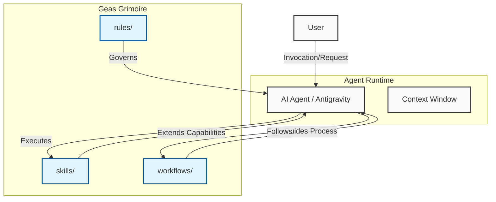

# System Architecture

## Application Overview
**geas-grimoire** is a specialized knowledge repository designed to empower AI agents with **Skills**, **Workflows**, and **Rules**. Unlike traditional software applications, this repository functions as a "Grimoire"—a library of modular executable logic and governance protocols that can be dynamically loaded or referenced by an agentic runtime (e.g., Antigravity, OpenCode).

The core philosophy is the separation of **Capability** (Skills), **Process** (Workflows), and **Identity/Governance** (Rules).

## Technology Stack 

### Core Formats
*   **Markdown (`.md`)**: The primary format for defining instructions, workflows, and rule sets. Optimized for LLM token consumption.
*   **YAML Frontmatter**: Used for metadata (name, description, tags) to allow programmatic parsing of skills and workflows.

### Scripting & Automation
*   **Python 3.x**: Used for the executable logic within Skills (e.g., `technical-doc-writer/scripts/`).
*   **Bash**: Simple automation scripts.

### Integrations
*   **Model Context Protocol (MCP)**: The repository aligns with MCP standards where applicable to expose tools and resources to the agent.
*   **Agent Runtimes**: Compatible with ClaudeCode, OpenCode, and custom Python agent loops.

## High-Level Architecture Diagram

The following diagram illustrates how an Agent interacts with the Geas Grimoire components.

## Directory Structure Strategy
The repository implements a flat, modular architecture to minimize cross-dependencies, allowing agents to ingest only the context they need.

*   `rules/`: Global and Persona-specific constraints.
*   `skills/`: Self-contained tool definitions (Folder = Skill).
*   `workflows/`: Step-by-step procedural guides.
